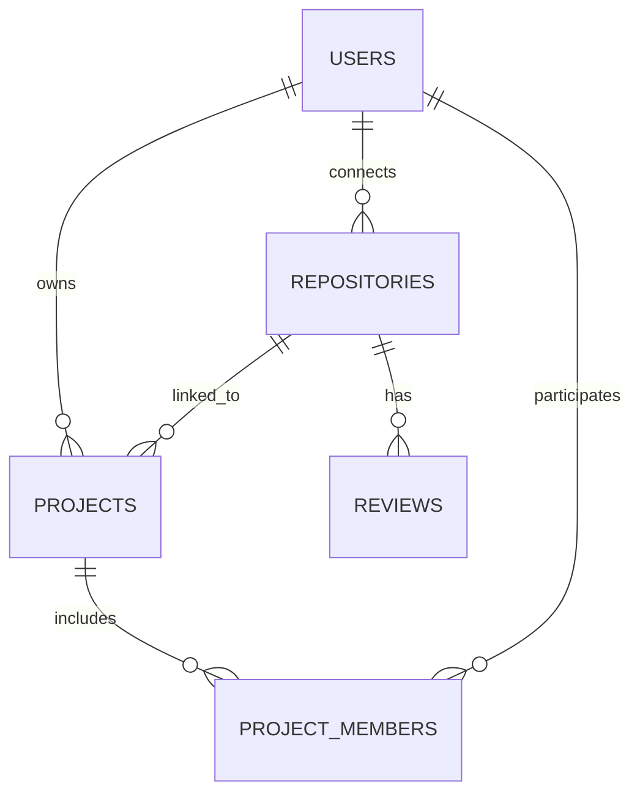

# System Design Document

## Project Overview

**Project Name:** WeKraft - Developer Collaboration Platform  
**Version:** 1.0  
**Date:** January 24, 2026  

### Design Philosophy

WeKraft follows a modern, scalable architecture that emphasizes real-time collaboration, AI-powered insights, and seamless developer experience. The system leverages cloud-native AWS services for reliability, performance, and cost-effectiveness.

## System Architecture

### 1. High-Level Architecture

```
┌─────────────────┐    ┌──────────────────┐    ┌─────────────────┐
│   Frontend      │    │   Backend APIs   │    │  External APIs  │
│   (Next.js)     │◄──►│   (Convex)       │◄──►│  (GitHub, AI)   │
└─────────────────┘    └──────────────────┘    └─────────────────┘
         │                       │                       │
         ▼                       ▼                       ▼
┌─────────────────┐    ┌──────────────────┐    ┌─────────────────┐
│  AWS CloudFront │    │   AWS Services   │    │   Monitoring    │
│  (CDN/Cache)    │    │  (S3, Bedrock)   │    │ (CloudWatch)    │
└─────────────────┘    └──────────────────┘    └─────────────────┘
```

### 2. Component Architecture

#### 2.1 Frontend Layer (Next.js Application)
- **Framework:** Next.js 16+ with App Router
- **UI Components:** shadcn/ui with Tailwind CSS
- **State Management:** Convex React hooks + TanStack Query
- **Authentication:** Clerk integration
- **Real-time Updates:** Convex subscriptions

#### 2.2 Backend Layer (Convex)
- **Database:** Convex real-time database
- **API Layer:** Convex functions and mutations
- **Authentication:** Clerk JWT integration
- **File Handling:** Direct S3 integration
- **Background Jobs:** Inngest for async processing

#### 2.3 AWS Services Integration

##### Amazon S3 (File Storage)
```typescript
// S3 Configuration
const s3Config = {
  region: 'ap-south-1',
  buckets: {
    projectAssets: 'wekraft-project-assets',
    userUploads: 'wekraft-user-uploads',
    staticContent: 'wekraft-static-content'
  },
  features: {
    versioning: true,
    encryption: 'AES256',
    lifecycle: 'intelligent-tiering',
    cors: 'configured-for-frontend'
  }
}
```

##### Amazon Bedrock (AI Services)
```typescript
// Bedrock Integration
const bedrockConfig = {
  region: 'us-east-1',
  models: {
    codeReview: 'anthropic.claude-3-sonnet-20240229-v1:0',
    codeGeneration: 'amazon.titan-text-express-v1',
    projectAnalysis: 'ai21.j2-ultra-v1'
  },
  features: {
    streaming: true,
    customModels: true,
    guardrails: 'enabled'
  }
}
```

##### Amazon CloudWatch (Monitoring)
```typescript
// CloudWatch Configuration
const cloudWatchConfig = {
  metrics: {
    custom: ['user-activity', 'ai-processing', 'project-health'],
    aws: ['s3-usage', 'bedrock-invocations', 'api-latency']
  },
  alarms: {
    errorRate: '>5%',
    responseTime: '>2s',
    aiProcessingTime: '>5min'
  },
  dashboards: ['system-overview', 'user-analytics', 'cost-monitoring']
}
```

## Data Architecture

### 3. Database Schema Design

#### 3.1 Core Entities

```typescript
// Users Table
interface User {
  _id: Id<"users">;
  name: string;
  tokenIdentifier: string; // Clerk user ID
  email: string;
  imageUrl?: string;
  hasCompletedOnboarding: boolean;
  githubUsername?: string;
  githubAccessToken?: string; // Encrypted
  type: "free" | "pro" | "elite";
  limit: 2 | 5 | 15;
  createdAt: number;
  updatedAt: number;
}

// Projects Table
interface Project {
  _id: Id<"projects">;
  projectName: string;
  description: string;
  tags: string[];
  isPublic: boolean;
  repositoryId: Id<"repositories">;
  ownerId: Id<"users">;
  healthScore?: ProjectHealthScore;
  projectStars?: number;
  projectForks?: number;
  thumbnailUrl?: string;
  createdAt: number;
  updatedAt: number;
}

// Health Score Structure
interface ProjectHealthScore {
  totalScore: number; // 0-100
  activityMomentum: number; // 0-35
  maintenanceQuality: number; // 0-35
  communityTrust: number; // 0-20
  freshness: number; // 0-10
  lastCalculatedDate: string;
  previousScores: Array<{
    totalScore: number;
    calculatedDate: string;
  }>;
}
```

#### 3.2 Data Relationships



### 4. API Design

#### 4.1 Convex Functions Structure

```typescript
// User Management
export const getCurrentUser = query({
  handler: async (ctx) => {
    // Get current authenticated user
  }
});

export const updateUserProfile = mutation({
  args: { name: v.string(), githubUsername: v.optional(v.string()) },
  handler: async (ctx, args) => {
    // Update user profile with validation
  }
});

// Project Management
export const createProject = mutation({
  args: {
    projectName: v.string(),
    description: v.string(),
    repositoryId: v.id("repositories"),
    tags: v.array(v.string()),
    isPublic: v.boolean()
  },
  handler: async (ctx, args) => {
    // Create project with health score initialization
  }
});

// AI Review System
export const triggerAIReview = action({
  args: { repositoryId: v.id("repositories"), prNumber: v.number() },
  handler: async (ctx, args) => {
    // Trigger AI review using Bedrock
  }
});
```

#### 4.2 REST API Endpoints

```typescript
// File Upload (S3 Integration)
POST /api/upload
- Handles file uploads to S3
- Returns signed URLs for direct upload
- Implements security validation

// AI Chat Interface
POST /api/chat
- Processes AI chat requests
- Integrates with Bedrock models
- Streams responses for real-time UX

// GitHub Webhook Handler
POST /api/github/webhook
- Processes GitHub events
- Triggers AI reviews on PR creation
- Updates repository statistics
```

## AWS Services Integration

### 5. Amazon S3 Implementation

#### 5.1 Bucket Structure
```
wekraft-project-assets/
├── projects/
│   ├── {projectId}/
│   │   ├── thumbnails/
│   │   ├── documentation/
│   │   └── assets/
├── users/
│   ├── {userId}/
│   │   ├── avatars/
│   │   └── uploads/
└── system/
    ├── templates/
    └── static/
```

#### 5.2 S3 Security Configuration
```json
{
  "Version": "2012-10-17",
  "Statement": [
    {
      "Sid": "PublicReadGetObject",
      "Effect": "Allow",
      "Principal": "*",
      "Action": "s3:GetObject",
      "Resource": "arn:aws:s3:::wekraft-project-assets/public/*"
    },
    {
      "Sid": "AuthenticatedUserUpload",
      "Effect": "Allow",
      "Principal": {
        "AWS": "arn:aws:iam::ACCOUNT:role/WeKraftUserRole"
      },
      "Action": [
        "s3:PutObject",
        "s3:GetObject",
        "s3:DeleteObject"
      ],
      "Resource": "arn:aws:s3:::wekraft-project-assets/users/*"
    }
  ]
}
```

#### 5.3 S3 Integration Code
```typescript
import { S3Client, PutObjectCommand, GetObjectCommand } from "@aws-sdk/client-s3";
import { getSignedUrl } from "@aws-sdk/s3-request-presigner";

export class S3Service {
  private s3Client: S3Client;
  
  constructor() {
    this.s3Client = new S3Client({
      region: process.env.AWS_REGION,
      credentials: {
        accessKeyId: process.env.AWS_ACCESS_KEY_ID!,
        secretAccessKey: process.env.AWS_SECRET_ACCESS_KEY!,
      },
    });
  }

  async generateUploadUrl(key: string, contentType: string): Promise<string> {
    const command = new PutObjectCommand({
      Bucket: process.env.S3_BUCKET_NAME,
      Key: key,
      ContentType: contentType,
    });
    
    return await getSignedUrl(this.s3Client, command, { expiresIn: 3600 });
  }

  async uploadFile(key: string, file: Buffer, contentType: string): Promise<void> {
    const command = new PutObjectCommand({
      Bucket: process.env.S3_BUCKET_NAME,
      Key: key,
      Body: file,
      ContentType: contentType,
    });
    
    await this.s3Client.send(command);
  }
}
```

### 6. Amazon Bedrock Implementation

#### 6.1 AI Model Configuration
```typescript
import { BedrockRuntimeClient, InvokeModelCommand } from "@aws-sdk/client-bedrock-runtime";

export class BedrockService {
  private bedrockClient: BedrockRuntimeClient;
  
  constructor() {
    this.bedrockClient = new BedrockRuntimeClient({
      region: "us-east-1",
      credentials: {
        accessKeyId: process.env.AWS_ACCESS_KEY_ID!,
        secretAccessKey: process.env.AWS_SECRET_ACCESS_KEY!,
      },
    });
  }

  async generateCodeReview(codeContent: string, prContext: string): Promise<string> {
    const prompt = `
      Analyze the following code changes and provide a comprehensive review:
      
      Context: ${prContext}
      Code: ${codeContent}
      
      Please provide:
      1. Code quality assessment
      2. Security considerations
      3. Performance implications
      4. Best practice recommendations
      5. Specific improvement suggestions
    `;

    const command = new InvokeModelCommand({
      modelId: "anthropic.claude-3-sonnet-20240229-v1:0",
      body: JSON.stringify({
        anthropic_version: "bedrock-2023-05-31",
        max_tokens: 4000,
        messages: [
          {
            role: "user",
            content: prompt
          }
        ]
      }),
      contentType: "application/json",
      accept: "application/json",
    });

    const response = await this.bedrockClient.send(command);
    const responseBody = JSON.parse(new TextDecoder().decode(response.body));
    return responseBody.content[0].text;
  }

  async analyzeProjectHealth(projectData: any): Promise<ProjectHealthScore> {
    const prompt = `
      Analyze the following project data and calculate health metrics:
      ${JSON.stringify(projectData)}
      
      Calculate scores for:
      - Activity Momentum (0-35): Recent commits, PRs, issues
      - Maintenance Quality (0-35): Code quality, documentation, testing
      - Community Trust (0-20): Stars, forks, contributor engagement
      - Freshness (0-10): Recent activity, dependency updates
    `;

    // Implementation similar to code review
    // Returns calculated health score object
  }
}
```

#### 6.2 AI Processing Pipeline
```typescript
export class AIProcessingPipeline {
  private bedrockService: BedrockService;
  private s3Service: S3Service;

  async processCodeReview(repositoryId: string, prNumber: number): Promise<void> {
    try {
      // 1. Fetch PR data from GitHub
      const prData = await this.fetchPRData(repositoryId, prNumber);
      
      // 2. Store code content in S3 for processing
      const s3Key = `reviews/${repositoryId}/${prNumber}/code.json`;
      await this.s3Service.uploadFile(s3Key, Buffer.from(JSON.stringify(prData)), 'application/json');
      
      // 3. Generate AI review using Bedrock
      const review = await this.bedrockService.generateCodeReview(
        prData.codeContent, 
        prData.context
      );
      
      // 4. Store review results
      await this.storeReviewResults(repositoryId, prNumber, review);
      
      // 5. Log metrics to CloudWatch
      await this.logMetrics('ai-review-completed', {
        repositoryId,
        prNumber,
        processingTime: Date.now() - startTime
      });
      
    } catch (error) {
      await this.logError('ai-review-failed', error, { repositoryId, prNumber });
      throw error;
    }
  }
}
```

### 7. Amazon CloudWatch Implementation

#### 7.1 Custom Metrics Configuration
```typescript
import { CloudWatchClient, PutMetricDataCommand } from "@aws-sdk/client-cloudwatch";

export class CloudWatchService {
  private cloudWatchClient: CloudWatchClient;
  
  constructor() {
    this.cloudWatchClient = new CloudWatchClient({
      region: process.env.AWS_REGION,
      credentials: {
        accessKeyId: process.env.AWS_ACCESS_KEY_ID!,
        secretAccessKey: process.env.AWS_SECRET_ACCESS_KEY!,
      },
    });
  }

  async putMetric(metricName: string, value: number, unit: string = 'Count', dimensions?: any[]): Promise<void> {
    const command = new PutMetricDataCommand({
      Namespace: 'WeKraft/Application',
      MetricData: [
        {
          MetricName: metricName,
          Value: value,
          Unit: unit,
          Timestamp: new Date(),
          Dimensions: dimensions,
        },
      ],
    });

    await this.cloudWatchClient.send(command);
  }

  async logUserActivity(userId: string, activity: string): Promise<void> {
    await this.putMetric('UserActivity', 1, 'Count', [
      { Name: 'UserId', Value: userId },
      { Name: 'Activity', Value: activity }
    ]);
  }

  async logAIProcessing(processingTime: number, success: boolean): Promise<void> {
    await this.putMetric('AIProcessingTime', processingTime, 'Milliseconds');
    await this.putMetric('AIProcessingSuccess', success ? 1 : 0, 'Count');
  }

  async logProjectHealth(projectId: string, healthScore: number): Promise<void> {
    await this.putMetric('ProjectHealthScore', healthScore, 'None', [
      { Name: 'ProjectId', Value: projectId }
    ]);
  }
}
```

#### 7.2 Monitoring Dashboard Configuration
```json
{
  "widgets": [
    {
      "type": "metric",
      "properties": {
        "metrics": [
          ["WeKraft/Application", "UserActivity"],
          ["WeKraft/Application", "AIProcessingTime"],
          ["WeKraft/Application", "ProjectHealthScore"]
        ],
        "period": 300,
        "stat": "Average",
        "region": "us-east-1",
        "title": "Application Metrics"
      }
    },
    {
      "type": "log",
      "properties": {
        "query": "SOURCE '/aws/lambda/wekraft-api' | fields @timestamp, @message | filter @message like /ERROR/ | sort @timestamp desc | limit 100",
        "region": "us-east-1",
        "title": "Error Logs"
      }
    }
  ]
}
```

## Security Architecture

### 8. Security Implementation

#### 8.1 Authentication & Authorization
```typescript
// Clerk JWT Validation
export const validateAuth = async (request: Request): Promise<User | null> => {
  const token = request.headers.get('Authorization')?.replace('Bearer ', '');
  if (!token) return null;

  try {
    const payload = await verifyToken(token, {
      issuer: process.env.CLERK_JWT_ISSUER_DOMAIN,
      audience: 'convex',
    });
    
    return await getUserByTokenIdentifier(payload.sub);
  } catch (error) {
    return null;
  }
};

// Role-based Access Control
export const checkProjectAccess = async (
  userId: string, 
  projectId: string, 
  requiredRole: 'read' | 'write' | 'admin'
): Promise<boolean> => {
  const project = await getProject(projectId);
  if (!project) return false;
  
  if (project.isPublic && requiredRole === 'read') return true;
  if (project.ownerId === userId) return true;
  
  const membership = await getProjectMembership(userId, projectId);
  return membership && hasPermission(membership.role, requiredRole);
};
```

#### 8.2 Data Encryption
```typescript
// GitHub Token Encryption
import { createCipher, createDecipher } from 'crypto';

export class EncryptionService {
  private readonly algorithm = 'aes-256-cbc';
  private readonly key = process.env.ENCRYPTION_KEY!;

  encrypt(text: string): string {
    const cipher = createCipher(this.algorithm, this.key);
    let encrypted = cipher.update(text, 'utf8', 'hex');
    encrypted += cipher.final('hex');
    return encrypted;
  }

  decrypt(encryptedText: string): string {
    const decipher = createDecipher(this.algorithm, this.key);
    let decrypted = decipher.update(encryptedText, 'hex', 'utf8');
    decrypted += decipher.final('utf8');
    return decrypted;
  }
}
```

## Performance Architecture

### 9. Performance Optimization

#### 9.1 Caching Strategy
```typescript
// Multi-layer Caching
export class CacheService {
  private redis: Redis;
  private memoryCache: Map<string, any>;

  async get(key: string): Promise<any> {
    // 1. Check memory cache
    if (this.memoryCache.has(key)) {
      return this.memoryCache.get(key);
    }

    // 2. Check Redis cache
    const redisValue = await this.redis.get(key);
    if (redisValue) {
      const parsed = JSON.parse(redisValue);
      this.memoryCache.set(key, parsed);
      return parsed;
    }

    return null;
  }

  async set(key: string, value: any, ttl: number = 3600): Promise<void> {
    this.memoryCache.set(key, value);
    await this.redis.setex(key, ttl, JSON.stringify(value));
  }
}

// Database Query Optimization
export const getProjectsWithCache = query({
  args: { userId: v.id("users") },
  handler: async (ctx, args) => {
    const cacheKey = `user-projects-${args.userId}`;
    
    let projects = await cache.get(cacheKey);
    if (!projects) {
      projects = await ctx.db
        .query("projects")
        .withIndex("by_owner", (q) => q.eq("ownerId", args.userId))
        .collect();
      
      await cache.set(cacheKey, projects, 300); // 5 min cache
    }
    
    return projects;
  }
});
```

#### 9.2 Real-time Updates
```typescript
// Convex Subscriptions for Real-time Data
export const useProjectUpdates = (projectId: string) => {
  const project = useQuery(api.projects.getProject, { projectId });
  const healthScore = useQuery(api.projects.getHealthScore, { projectId });
  
  // Automatic re-rendering when data changes
  return { project, healthScore };
};

// WebSocket Integration for Live Collaboration
export class RealtimeService {
  private ws: WebSocket;
  
  subscribeToProject(projectId: string, callback: (update: any) => void): void {
    this.ws.send(JSON.stringify({
      type: 'subscribe',
      channel: `project-${projectId}`,
    }));
    
    this.ws.onmessage = (event) => {
      const data = JSON.parse(event.data);
      if (data.channel === `project-${projectId}`) {
        callback(data.payload);
      }
    };
  }
}
```

## Deployment Architecture

### 10. Infrastructure as Code

#### 10.1 AWS CDK Configuration
```typescript
import * as cdk from 'aws-cdk-lib';
import * as s3 from 'aws-cdk-lib/aws-s3';
import * as cloudwatch from 'aws-cdk-lib/aws-cloudwatch';
import * as iam from 'aws-cdk-lib/aws-iam';

export class WeKraftInfrastructureStack extends cdk.Stack {
  constructor(scope: Construct, id: string, props?: cdk.StackProps) {
    super(scope, id, props);

    // S3 Buckets
    const projectAssetsBucket = new s3.Bucket(this, 'ProjectAssetsBucket', {
      bucketName: 'wekraft-project-assets',
      versioned: true,
      encryption: s3.BucketEncryption.S3_MANAGED,
      lifecycleRules: [{
        id: 'intelligent-tiering',
        status: s3.LifecycleRuleStatus.ENABLED,
        transitions: [{
          storageClass: s3.StorageClass.INTELLIGENT_TIERING,
          transitionAfter: cdk.Duration.days(1),
        }],
      }],
      cors: [{
        allowedMethods: [s3.HttpMethods.GET, s3.HttpMethods.PUT, s3.HttpMethods.POST],
        allowedOrigins: ['https://wekraft.dev', 'http://localhost:3000'],
        allowedHeaders: ['*'],
      }],
    });

    // IAM Role for Application
    const appRole = new iam.Role(this, 'WeKraftAppRole', {
      assumedBy: new iam.ServicePrincipal('lambda.amazonaws.com'),
      managedPolicies: [
        iam.ManagedPolicy.fromAwsManagedPolicyName('service-role/AWSLambdaBasicExecutionRole'),
      ],
      inlinePolicies: {
        S3Access: new iam.PolicyDocument({
          statements: [
            new iam.PolicyStatement({
              effect: iam.Effect.ALLOW,
              actions: ['s3:GetObject', 's3:PutObject', 's3:DeleteObject'],
              resources: [projectAssetsBucket.arnForObjects('*')],
            }),
          ],
        }),
        BedrockAccess: new iam.PolicyDocument({
          statements: [
            new iam.PolicyStatement({
              effect: iam.Effect.ALLOW,
              actions: ['bedrock:InvokeModel'],
              resources: ['*'],
            }),
          ],
        }),
        CloudWatchAccess: new iam.PolicyDocument({
          statements: [
            new iam.PolicyStatement({
              effect: iam.Effect.ALLOW,
              actions: ['cloudwatch:PutMetricData', 'logs:CreateLogGroup', 'logs:CreateLogStream', 'logs:PutLogEvents'],
              resources: ['*'],
            }),
          ],
        }),
      },
    });

    // CloudWatch Dashboard
    const dashboard = new cloudwatch.Dashboard(this, 'WeKraftDashboard', {
      dashboardName: 'WeKraft-System-Metrics',
    });

    dashboard.addWidgets(
      new cloudwatch.GraphWidget({
        title: 'Application Metrics',
        left: [
          new cloudwatch.Metric({
            namespace: 'WeKraft/Application',
            metricName: 'UserActivity',
            statistic: 'Sum',
          }),
        ],
        right: [
          new cloudwatch.Metric({
            namespace: 'WeKraft/Application',
            metricName: 'AIProcessingTime',
            statistic: 'Average',
          }),
        ],
      })
    );
  }
}
```

#### 10.2 Environment Configuration
```typescript
// Environment-specific configurations
export const environments = {
  development: {
    aws: {
      region: 'ap-south-1',
      s3Bucket: 'wekraft-dev-assets',
      bedrockRegion: 'us-east-1',
    },
    convex: {
      url: process.env.NEXT_PUBLIC_CONVEX_URL_DEV,
    },
    clerk: {
      publishableKey: process.env.NEXT_PUBLIC_CLERK_PUBLISHABLE_KEY_DEV,
    },
  },
  production: {
    aws: {
      region: 'ap-south-1',
      s3Bucket: 'wekraft-prod-assets',
      bedrockRegion: 'us-east-1',
    },
    convex: {
      url: process.env.NEXT_PUBLIC_CONVEX_URL_PROD,
    },
    clerk: {
      publishableKey: process.env.NEXT_PUBLIC_CLERK_PUBLISHABLE_KEY_PROD,
    },
  },
};
```

## Testing Strategy

### 11. Testing Architecture

#### 11.1 Unit Testing
```typescript
// Component Testing with React Testing Library
import { render, screen, fireEvent } from '@testing-library/react';
import { ProjectCard } from '@/components/ProjectCard';

describe('ProjectCard', () => {
  it('should display project information correctly', () => {
    const mockProject = {
      id: '1',
      name: 'Test Project',
      description: 'Test Description',
      healthScore: { totalScore: 85 },
    };

    render(<ProjectCard project={mockProject} />);
    
    expect(screen.getByText('Test Project')).toBeInTheDocument();
    expect(screen.getByText('Test Description')).toBeInTheDocument();
    expect(screen.getByText('85')).toBeInTheDocument();
  });
});

// API Testing
import { ConvexTestingHelper } from 'convex/testing';
import { api } from '../convex/_generated/api';

describe('Project API', () => {
  let t: ConvexTestingHelper;

  beforeEach(() => {
    t = new ConvexTestingHelper();
  });

  it('should create project successfully', async () => {
    const userId = await t.mutation(api.users.create, {
      name: 'Test User',
      email: 'test@example.com',
    });

    const projectId = await t.mutation(api.projects.create, {
      projectName: 'Test Project',
      description: 'Test Description',
      ownerId: userId,
    });

    expect(projectId).toBeDefined();
  });
});
```

#### 11.2 Integration Testing
```typescript
// AWS Services Integration Testing
import { S3Service } from '@/lib/s3';
import { BedrockService } from '@/lib/bedrock';

describe('AWS Integration', () => {
  let s3Service: S3Service;
  let bedrockService: BedrockService;

  beforeAll(() => {
    s3Service = new S3Service();
    bedrockService = new BedrockService();
  });

  it('should upload file to S3 successfully', async () => {
    const testFile = Buffer.from('test content');
    const key = `test/${Date.now()}.txt`;

    await s3Service.uploadFile(key, testFile, 'text/plain');
    
    // Verify file exists
    const exists = await s3Service.fileExists(key);
    expect(exists).toBe(true);

    // Cleanup
    await s3Service.deleteFile(key);
  });

  it('should generate AI review using Bedrock', async () => {
    const codeContent = 'function test() { return "hello"; }';
    const context = 'Simple JavaScript function';

    const review = await bedrockService.generateCodeReview(codeContent, context);
    
    expect(review).toBeDefined();
    expect(review.length).toBeGreaterThan(0);
  });
});
```

## Monitoring & Observability

### 12. Monitoring Implementation

#### 12.1 Application Monitoring
```typescript
// Custom Monitoring Service
export class MonitoringService {
  private cloudWatch: CloudWatchService;
  
  async trackUserAction(userId: string, action: string, metadata?: any): Promise<void> {
    await this.cloudWatch.putMetric('UserAction', 1, 'Count', [
      { Name: 'UserId', Value: userId },
      { Name: 'Action', Value: action },
    ]);

    console.log(`User Action: ${userId} performed ${action}`, metadata);
  }

  async trackPerformance(operation: string, duration: number): Promise<void> {
    await this.cloudWatch.putMetric(`${operation}Duration`, duration, 'Milliseconds');
    
    if (duration > 5000) {
      console.warn(`Slow operation detected: ${operation} took ${duration}ms`);
    }
  }

  async trackError(error: Error, context?: any): Promise<void> {
    await this.cloudWatch.putMetric('ApplicationError', 1, 'Count', [
      { Name: 'ErrorType', Value: error.constructor.name },
    ]);

    console.error('Application Error:', {
      message: error.message,
      stack: error.stack,
      context,
    });
  }
}
```

#### 12.2 Health Checks
```typescript
// System Health Monitoring
export class HealthCheckService {
  async checkSystemHealth(): Promise<HealthStatus> {
    const checks = await Promise.allSettled([
      this.checkDatabase(),
      this.checkS3Connection(),
      this.checkBedrockAvailability(),
      this.checkExternalAPIs(),
    ]);

    const results = checks.map((check, index) => ({
      service: ['database', 's3', 'bedrock', 'external-apis'][index],
      status: check.status === 'fulfilled' ? 'healthy' : 'unhealthy',
      details: check.status === 'fulfilled' ? check.value : check.reason,
    }));

    const overallHealth = results.every(r => r.status === 'healthy') ? 'healthy' : 'degraded';

    return {
      status: overallHealth,
      timestamp: new Date().toISOString(),
      services: results,
    };
  }

  private async checkDatabase(): Promise<string> {
    // Test Convex connection
    return 'Connected';
  }

  private async checkS3Connection(): Promise<string> {
    // Test S3 connectivity
    return 'Connected';
  }

  private async checkBedrockAvailability(): Promise<string> {
    // Test Bedrock model availability
    return 'Available';
  }

  private async checkExternalAPIs(): Promise<string> {
    // Test GitHub API, etc.
    return 'Connected';
  }
}
```

This comprehensive design document provides a detailed blueprint for implementing WeKraft with integrated AWS services (S3, Bedrock, and CloudWatch) while maintaining scalability, security, and performance standards.